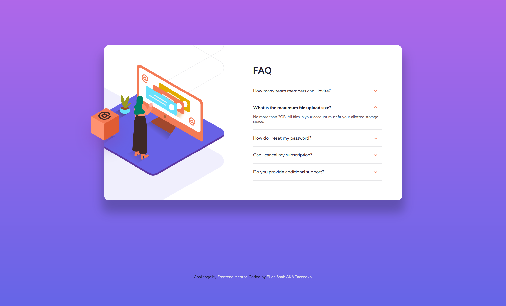

# Frontend Mentor - FAQ accordion card solution

This is a solution to the [FAQ accordion card challenge on Frontend Mentor](https://www.frontendmentor.io/challenges/faq-accordion-card-XlyjD0Oam). Frontend Mentor challenges help you improve your coding skills by building realistic projects. 

## Table of contents

- [Overview](#overview)
  - [The challenge](#the-challenge)
  - [Screenshot](#screenshot)
  - [Links](#links)
- [My process](#my-process)
  - [Built with](#built-with)
  - [What I learned](#what-i-learned)
  - [Continued development](#continued-development)
  - [Useful resources](#useful-resources)
- [Author](#author)

## Overview

This was a very fun challenge! I tried to do it with zero JS, and I think I succeeded.

### The challenge

Users should be able to:

- View the optimal layout for the component depending on their device's screen size
- See hover states for all interactive elements on the page
- Hide/Show the answer to a question when the question is clicked

### Screenshot

### Links

- Solution URL: [Add solution URL here](https://your-solution-url.com)
- Live Site URL: [Add live site URL here](https://your-live-site-url.com)

## My process

I had to look up a lot of stuff for this one. I got very frustrated, and I had to use "hacks" to get things to work properly. I still wasn't able to get the box moving effect while focusing, but that's a limitation of the HTML. 

### Built with

- Semantic HTML5 markup
- CSS custom properties
- CSS Grid
- Absolutely NO Javascript!

### What I learned

I learnt about using absolute and fixed positioning effectively. I also learnt that `
` and `
` even existed. It makes me wonder why people still bother doing Javascript accordions, except in cases where they need fancy animations.

### Continued development

I'm going to eat McDonald's breakfast. That's my continued development.

### Useful resources

- [Codepen: breaking out of overflow hidden](https://codepen.io/dr2009/pen/XLrVbK) - I found this codepen and used the `translate3D` hack shown here to get the box's positioning to work correctly.
- [How to build an HTML-only Accordion](https://dev.to/whitep4nth3r/how-to-build-an-html-only-accordion-no-javascript-required-4jc4) - This article taught me about the `
` and `
` elements.

## Author

- Frontend Mentor - [@taco-neko](https://www.frontendmentor.io/profile/taco-neko)
